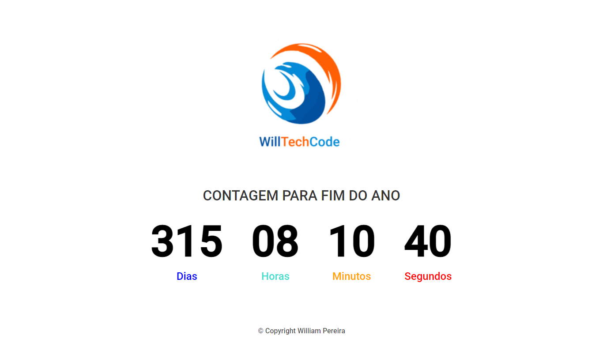

<<<<<<< HEAD
=======
### CoTagem para fim de ano com javaScript HTML5 E CSS
link para abrir projeto

>>>>>>> 38328052636de1e01523509f5257f1cc7b8c7890

# Indice

- [Sobre](#-sobre)
- [Tecnologias](#Tecnologias)
<<<<<<< HEAD
- [Como Acessar o projeto](#-como-acessar-o-projeto)

## 🔖&nbsp; Sobre

Projeto desenvolvido para testar minhas habilidades com html, css e javascript básico.
Muito simples e intuitivo.
=======
- [Como baixar o projeto](#-como-baixar-o-projeto)

## 🔖&nbsp; Sobre

Projeto desenvolvido para simular um aplicativo de aluguel de casas
>>>>>>> 38328052636de1e01523509f5257f1cc7b8c7890

---

## Tecnologias

<<<<<<< HEAD
Esse projeto foi desenvolvido com as seguintes tecnologias:

- [HTML5](https://html.spec.whatwg.org/)
- [CSS3](https://www.w3.org/TR/CSS/)
- [JavaScript](https://www.javascript.com/)
=======
um cronômetro que registra quanto tempo falta para um novo ano,
básico para teste de lógica e prática de estudos.

_ [HTML5](https://html.spec.whatwg.org/)
- [CSS3](https://www.w3.org/TR/css3-roadmap/)
- [javaScript](https://brasil.js.org/)
>>>>>>> 38328052636de1e01523509f5257f1cc7b8c7890

## Como acessar o projeto

[Clique aqui](https://willtechcod.github.io/contagemFimdeAno/)

---

<h3 align="center" >Vamos nos conectar 😉</h3>

  <a href="https://www.linkedin.com/in/william-pereira-da-concei%C3%A7%C3%A3o-ba4496127/">
<<<<<<< HEAD
    
  </a>&ensp;
  &ensp;
  <a href="https://www.instagram.com/willtechcode/">
    
=======
    
  </a>&ensp;
  &ensp;
  <a href="https://www.instagram.com/willtechcode/">
    
>>>>>>> 38328052636de1e01523509f5257f1cc7b8c7890
  </a>

 

    Desenvolvido 💜 por William Pereira Da Conceição

